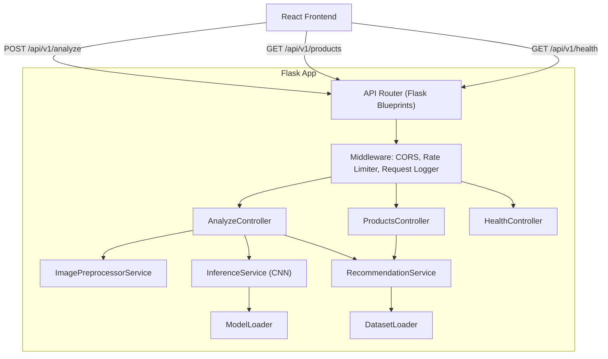

# Design Document: SkinIntel Backend

## Overview

The SkinIntel backend is a Python Flask REST API that serves as the intelligence layer for an AI-powered skincare recommendation application. It accepts skin images from users, classifies the dominant skin concern using a CNN model, and returns filtered product recommendations from an in-memory indexed dataset.

The system is designed for single-server or serverless deployment with no external caching dependencies. All heavy resources (model weights, product dataset) are loaded once at startup and held in memory for the lifetime of the process.

---

## Architecture

The backend follows a strict layered architecture:

```
Controller Layer  →  Service Layer  →  ML Layer  →  Data Layer
(Flask routes)       (Business logic)  (Inference)   (Dataset index)
```



### Deployment

- **Runtime**: Python 3.10+, Flask 3.x, Gunicorn (multi-worker)
- **Containerization**: Docker (single image, multi-stage build)
- **Environments**: `dev` (Flask dev server), `staging`/`prod` (Gunicorn, 4 workers)
- **Scaling**: Horizontal via multiple container instances (stateless — model and dataset loaded per instance)

---

## Components and Interfaces

### 1. Flask Application Factory (`app.py`)

```python
def create_app(config: Config) -> Flask:
    app = Flask(__name__)
    configure_cors(app, config.ALLOWED_ORIGIN)
    register_blueprints(app)
    register_error_handlers(app)
    return app
```

Startup sequence (executed before first request):
1. Load environment config
2. `ModelLoader.load(config.MODEL_PATH)` — exits on failure
3. `DatasetLoader.load(config.PRODUCTS_CSV_PATH)` — exits on failure
4. Start Flask/Gunicorn

### 2. ImagePreprocessorService

Responsibilities: validate MIME type, enforce size limit, SSRF-guard URL fetching, decode and normalize image.

```python
class ImagePreprocessorService:
    def preprocess_file(self, file: FileStorage) -> np.ndarray: ...
    def preprocess_url(self, url: str) -> np.ndarray: ...
    def _validate_mime(self, file: FileStorage) -> None: ...
    def _validate_size(self, file: FileStorage) -> None: ...
    def _ssrf_guard(self, url: str) -> None: ...
    def _fetch_with_retry(self, url: str, max_retries: int = 3) -> bytes: ...
    def _decode_and_normalize(self, image_bytes: bytes) -> np.ndarray: ...
```

Output tensor shape: `(1, 224, 224, 3)`, dtype `float32`, values in `[0.0, 1.0]`.

### 3. ModelLoader

Singleton that loads and holds the Keras model in memory.

```python
class ModelLoader:
    _model: tf.keras.Model = None

    @classmethod
    def load(cls, model_path: str) -> None: ...

    @classmethod
    def get_model(cls) -> tf.keras.Model: ...

    @classmethod
    def is_loaded(cls) -> bool: ...
```

### 4. InferenceService

```python
class InferenceService:
    LABELS = ["acne", "dark_circles", "blackheads", "oily_skin",
              "dry_skin", "normal_skin", "hyperpigmentation", "wrinkles"]
    CONFIDENCE_THRESHOLD = 0.40
    EXPLANATIONS: dict[str, str] = { ... }  # static per-label explanations

    def predict(self, tensor: np.ndarray) -> InferenceResult: ...
```

```python
@dataclass
class InferenceResult:
    concern_label: str
    confidence: float
    low_confidence: bool
    explanation: str
    effective_concern: str  # = concern_label if confidence >= threshold, else "general_skincare"
```

### 5. RecommendationService

```python
class RecommendationService:
    def get_recommendations(
        self,
        concern: str,
        country: str,
        min_price: float,
        max_price: float,
        limit: int = 10,
        offset: int = 0,
    ) -> RecommendationResult: ...
```

```python
@dataclass
class RecommendationResult:
    products: list[Product]
    total_count: int
    no_results: bool
```

Lookup uses the in-memory index: `index[(concern, country)]` → list of Product, then filters by price, sorts by rating desc, applies pagination.

Fallback chain:
1. Filter by `(effective_concern, country)` + price range
2. If empty → filter by `("general_skincare", country)` + price range
3. If still empty → return `no_results: true`

### 6. DatasetLoader

```python
class DatasetLoader:
    _products: list[Product] = []
    _index: dict[tuple[str, str], list[Product]] = {}

    @classmethod
    def load(cls, csv_path: str) -> None: ...

    @classmethod
    def get_index(cls) -> dict: ...

    @classmethod
    def is_loaded(cls) -> bool: ...

    @classmethod
    def record_count(cls) -> int: ...
```

Index construction at load time:
```python
for product in products:
    for concern in product.concern_tags:
        for country in product.available_countries:
            index[(concern, country)].append(product)
```

### 7. Middleware

- **CORS**: `flask-cors`, origin from `ALLOWED_ORIGIN`
- **Rate Limiter**: In-memory `collections.defaultdict` keyed by client IP, sliding window per minute. Returns 429 on breach.
- **Request Logger**: Before/after request hooks emit structured JSON logs with `request_id`, timing, status.

---

## Data Models

### Product

```python
@dataclass
class Product:
    product_id: str
    name: str
    brand: str
    price: float
    currency: str
    rating: float
    description: str
    concern_tags: list[str]
    available_countries: list[str]
    links: ProductLinks
```

### ProductLinks

```python
@dataclass
class ProductLinks:
    amazon: str | None
    nykaa: str | None
    flipkart: str | None
```

### Standard Response Envelope

```python
{
    "success": bool,
    "data": dict | list | None,
    "error": {
        "code": str,
        "message": str
    } | None,
    "meta": {
        "request_id": str,
        "timestamp": str,          # ISO 8601
        "model_version": str,      # from MODEL_VERSION env
        "inference_time_ms": float,  # analyze endpoint only
        "total_time_ms": float,
        "total_count": int,        # products endpoints
        "limit": int,
        "offset": int
    }
}
```

### Config

```python
@dataclass
class Config:
    MODEL_PATH: str
    MODEL_VERSION: str
    PRODUCTS_CSV_PATH: str
    ALLOWED_ORIGIN: str = "*"
    MAX_IMAGE_SIZE_MB: int = 10
    PORT: int = 5000
    ENV: str = "dev"
    RATE_LIMIT_PER_MINUTE: int = 30
    CONFIDENCE_THRESHOLD: float = 0.40
```

---

## CNN Model Design

### Dataset

- **Skin condition classification**: [Skin Disease Image Dataset (Kaggle)](https://www.kaggle.com/datasets/ismailpromus/skin-diseases-image-dataset) or DermNet NZ subset — 8 classes matching the concern labels.
- **Skincare products**: [Skincare Products Dataset (Kaggle)](https://www.kaggle.com/datasets/kingabzpro/cosmetics-datasets) — augmented with `concern_tags`, `available_countries`, and `links` columns.

### Model Architecture

Backbone: **MobileNetV2** (pretrained on ImageNet, `include_top=False`)

```
Input (224, 224, 3)
  → MobileNetV2 backbone (frozen initially)
  → GlobalAveragePooling2D
  → Dense(256, activation='relu')
  → Dropout(0.3)
  → Dense(8, activation='softmax')   # 8 concern classes
```

Training strategy:
1. Phase 1: Train only the classification head (backbone frozen), 10 epochs, lr=1e-3
2. Phase 2: Unfreeze top 30 layers of backbone, fine-tune, 10 epochs, lr=1e-5
3. Data augmentation: horizontal flip, rotation ±15°, zoom ±10%, brightness ±20%
4. Loss: categorical crossentropy; Metric: top-1 accuracy

Saved as `model.keras` (Keras native format). Loaded via `tf.keras.models.load_model()`.

### Inference Pipeline

```
Raw bytes
  → PIL.Image.open()
  → Resize to (224, 224)
  → np.array(dtype=float32) / 255.0
  → np.expand_dims(axis=0)   → shape (1, 224, 224, 3)
  → model.predict()          → shape (1, 8)
  → np.argmax()              → class index
  → LABELS[index]            → concern_label
  → softmax[index]           → confidence
```

---

## API Endpoints

### POST /api/v1/analyze

**Request** (multipart/form-data):
| Field | Type | Required |
|---|---|---|
| `image` | file | one of image/image_url |
| `image_url` | string | one of image/image_url |
| `country` | string | yes |
| `min_price` | float | yes |
| `max_price` | float | yes |
| `limit` | int | no (default 10) |
| `offset` | int | no (default 0) |

**Response 200**:
```json
{
  "success": true,
  "data": {
    "concern_label": "acne",
    "confidence": 0.87,
    "low_confidence": false,
    "explanation": "Acne is characterized by clogged pores...",
    "products": [ { "product_id": "...", "name": "...", ... } ]
  },
  "error": null,
  "meta": {
    "request_id": "uuid",
    "timestamp": "2024-01-01T00:00:00Z",
    "model_version": "1.0.0",
    "inference_time_ms": 42.3,
    "total_time_ms": 310.5,
    "total_count": 24,
    "limit": 10,
    "offset": 0
  }
}
```

### GET /api/v1/products

**Query params**: `concern`, `country`, `min_price`, `max_price`, `limit`, `offset`

**Response 200**: Same envelope, `data.products` array, no inference fields in `meta`.

### GET /api/v1/health

**Response 200**:
```json
{
  "success": true,
  "data": {
    "status": "ok",
    "model_loaded": true,
    "dataset_loaded": true,
    "model_version": "1.0.0",
    "dataset_record_count": 12500
  },
  "error": null,
  "meta": { "request_id": "...", "timestamp": "..." }
}
```

---

## Error Handling

| Scenario | HTTP Status | `error.code` |
|---|---|---|
| Missing required field | 400 | `validation_error` |
| Invalid country code | 400 | `invalid_country` |
| min_price > max_price | 400 | `invalid_price_range` |
| Invalid image URL scheme / SSRF | 400 | `invalid_image_url` |
| Unsupported MIME type | 415 | `unsupported_media_type` |
| Image too large | 413 | `image_too_large` |
| Corrupted image | 422 | `image_decode_error` |
| URL fetch failed after retries | 502 | `image_fetch_failed` |
| Request timeout | 504 | `request_timeout` |
| Rate limit exceeded | 429 | `rate_limit_exceeded` |
| Model inference exception | 500 | `model_inference_failed` |
| Unhandled exception | 500 | `internal_server_error` |

All error responses use the Standard_Response envelope with `success: false`, `data: null`, and a populated `error` object.

---

## Testing Strategy

### Dual Testing Approach

Both unit tests and property-based tests are required and complementary:
- **Unit tests**: Verify specific examples, edge cases, and error conditions
- **Property tests**: Verify universal properties across all inputs using `hypothesis` library

### Property-Based Testing Configuration

- Library: **`hypothesis`** (Python)
- Minimum 100 iterations per property test (`settings(max_examples=100)`)
- Each property test references its design property number in a comment
- Tag format: `# Feature: skinintel-backend, Property N: <property_text>`

### Unit Testing

- Framework: **`pytest`**
- Coverage target: 80% line coverage
- Mock `ModelLoader` and `DatasetLoader` in controller/service tests
- Use `pytest-flask` for route testing

### Test Structure

```
tests/
  unit/
    test_image_preprocessor.py
    test_inference_service.py
    test_recommendation_service.py
    test_dataset_loader.py
    test_routes.py
  property/
    test_recommendation_properties.py
    test_preprocessing_properties.py
    test_response_envelope_properties.py
```

---

## Correctness Properties

*A property is a characteristic or behavior that should hold true across all valid executions of a system — essentially, a formal statement about what the system should do. Properties serve as the bridge between human-readable specifications and machine-verifiable correctness guarantees.*


### Property 1: Preprocessing output invariant

*For any* valid image (JPEG, PNG, or WebP, any resolution, any content), the output of `ImagePreprocessorService` must always be a numpy array of shape `(1, 224, 224, 3)` with all values in the closed interval `[0.0, 1.0]`.

**Validates: Requirements 2.3**

---

### Property 2: Inference label validity

*For any* valid preprocessed image tensor of shape `(1, 224, 224, 3)`, the `concern_label` returned by `InferenceService.predict()` must always be one of the 8 supported labels: `acne`, `dark_circles`, `blackheads`, `oily_skin`, `dry_skin`, `normal_skin`, `hyperpigmentation`, `wrinkles`.

**Validates: Requirements 3.1, 3.3**

---

### Property 3: Inference result invariants

*For any* valid image tensor, the `InferenceResult` returned by `InferenceService.predict()` must satisfy all of the following simultaneously:
- `confidence` is a float in `[0.0, 1.0]`
- `low_confidence` is `True` if and only if `confidence < 0.40`
- `effective_concern` equals `concern_label` when `low_confidence` is `False`, and equals `"general_skincare"` when `low_confidence` is `True`

**Validates: Requirements 3.3, 3.4**

---

### Property 4: Explanation always present

*For any* valid analyze request that returns a 200 response, the `data.explanation` field must be a non-empty string.

**Validates: Requirements 3.7**

---

### Property 5: Recommendation filter correctness

*For any* product dataset, concern label, country code, and price range `(min_price, max_price)` where `min_price <= max_price`, every product returned by `RecommendationService.get_recommendations()` must satisfy all three conditions simultaneously:
- `concern_label` is in the product's `concern_tags`
- `country_code` is in the product's `available_countries`
- `product.price >= min_price` and `product.price <= max_price`

**Validates: Requirements 4.1, 4.2, 4.3**

---

### Property 6: Recommendation sort invariant

*For any* non-empty list of products returned by `RecommendationService.get_recommendations()`, the products must be in non-increasing order of `rating` (i.e., `products[i].rating >= products[i+1].rating` for all valid `i`).

**Validates: Requirements 4.4**

---

### Property 7: Pagination correctness

*For any* product dataset and any valid `limit` and `offset` values, the products returned by `RecommendationService.get_recommendations(limit=L, offset=O)` must equal the slice `all_filtered_sorted_products[O : O + L]`, and `meta.total_count` must equal `len(all_filtered_sorted_products)` regardless of pagination parameters.

**Validates: Requirements 4.5**

---

### Property 8: Dataset index completeness

*For any* product loaded by `DatasetLoader`, the product must appear in the in-memory index under every `(concern, country)` key pair derived from the Cartesian product of its `concern_tags` and `available_countries`. No product may be silently dropped from the index.

**Validates: Requirements 5.7**

---

### Property 9: Response envelope invariant

*For any* HTTP request to any endpoint (success or error, any status code), the JSON response body must always contain a `meta.request_id` field that is a non-empty string, and `success` must be `True` if and only if the HTTP status code is in the 2xx range.

**Validates: Requirements 1.6, 9.1**

---

### Property 10: No stack traces in error responses

*For any* request that results in an error response (4xx or 5xx), the response body string must not contain any of the following Python stack trace markers: `"Traceback"`, `"File \""`, `"line "`, `"raise "`. Internal paths and exception details must never be exposed.

**Validates: Requirements 9.5**

---

### Property 11: Products/analyze endpoint consistency

*For any* concern label, country code, price range, limit, and offset, calling `GET /api/v1/products` with those parameters must return the same `products` array and `total_count` as the `data.products` and `meta.total_count` fields in the response from `POST /api/v1/analyze` when the analyze endpoint uses the same concern label (i.e., the same filtering logic is applied in both paths).

**Validates: Requirements 6.4**

---

### Property 12: Structured log format

*For any* request processed by the API, the log output must contain at least one valid JSON object per request that includes all of: `request_id`, `method`, `path`, `status_code`, `total_time_ms`, and `timestamp`. For any request that results in an error, an additional JSON log entry must include `request_id`, `error_type`, `message`, and `timestamp`.

**Validates: Requirements 9.2, 9.3**

---

## Error Handling (continued)

All error responses follow the Standard_Response envelope. The `error` object always contains `code` and `message`. Stack traces are logged server-side only and never included in response bodies. The `ENV=prod` setting suppresses verbose internal details from `message` fields.

Graceful degradation:
- Low confidence → fallback to `general_skincare` concern for product filtering, `low_confidence: true` in response
- No products after fallback → `no_results: true`, empty `products` array, still 200 OK
- Model load failure → process exits at startup (fail-fast)
- Dataset load failure → process exits at startup (fail-fast)
